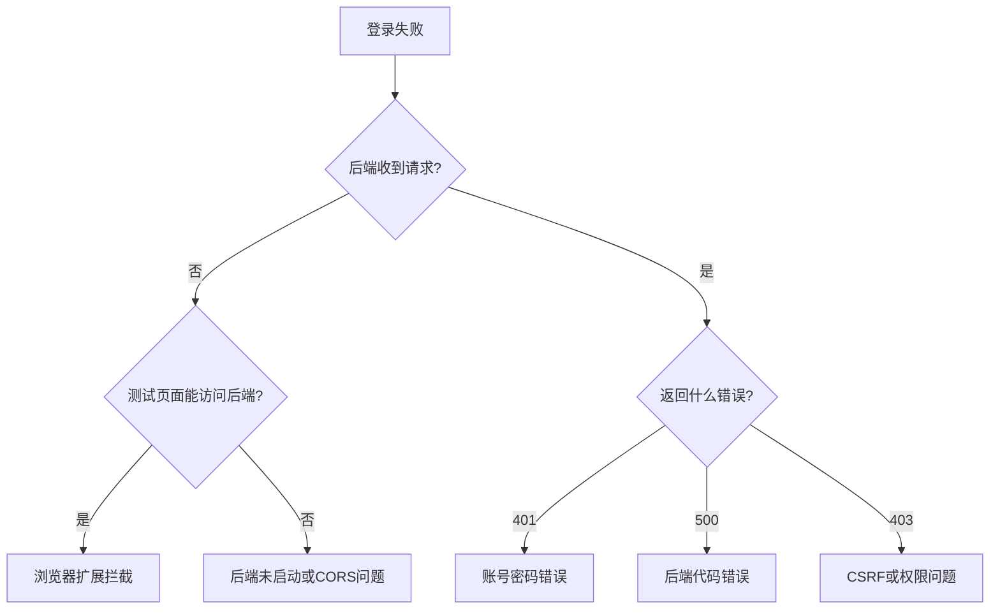

# 登录问题调试指南

## 当前错误分析

**错误信息：** `A listener indicated an asynchronous response by returning true, but the message channel closed before a response was received`

**原因分析：**
1. 这个错误通常由**浏览器扩展**引起（如广告拦截器、隐私保护插件）
2. 如果"后端没有收到请求"，说明请求在浏览器端就被拦截了

---

## 🔍 快速诊断步骤

### 1️⃣ 检查后端是否运行

在命令行运行：
```bash
curl http://localhost:8123/api/user/list
```

**预期结果：** 返回JSON格式的用户列表

**如果失败：**
- 检查后端服务是否启动
- 检查端口是否为8123
- 查看后端控制台日志

---

### 2️⃣ 使用测试页面

访问：`http://localhost:5173/test-api.html`

依次点击3个测试按钮，记录结果：
- ✅ 测试1通过 → CORS配置正确
- ✅ 测试2通过 → Vite代理工作正常
- ✅ 测试3通过 → 登录接口正常

**如果都通过但Vue应用还是报错** → 浏览器扩展问题

---

### 3️⃣ 排除浏览器扩展干扰

**方法1：使用无痕模式**
- Chrome: `Ctrl + Shift + N`
- Firefox: `Ctrl + Shift + P`
- Edge: `Ctrl + Shift + N`

在无痕模式访问：`http://localhost:5173/login`

**方法2：禁用可疑扩展**

常见干扰扩展：
- ❌ AdBlock Plus / uBlock Origin（广告拦截）
- ❌ Privacy Badger（隐私保护）
- ❌ Ghostery（追踪器拦截）
- ❌ 某些VPN扩展

临时禁用这些扩展后重试。

---

### 4️⃣ 检查浏览器开发者工具

**打开开发者工具（F12）：**

#### Network 标签
1. 刷新登录页面
2. 点击登录按钮
3. 查看 `/api/user/login` 请求

**正常情况应该看到：**
```
Request URL: http://localhost:5173/api/user/login
Request Method: POST
Status Code: 200
```

**如果看到：**
- ❌ 请求被 `(canceled)` → 浏览器扩展拦截
- ❌ 请求被 `(blocked:other)` → 内容安全策略问题
- ❌ `net::ERR_CONNECTION_REFUSED` → 后端未启动或端口错误
- ❌ `CORS policy error` → CORS配置问题

#### Console 标签
查看是否有其他错误信息：
- 红色错误信息
- 黄色警告信息

**重要：** 截图并记录完整的错误堆栈。

---

## 🔧 针对性解决方案

### 情况A: 后端未收到请求 + 浏览器扩展错误

**解决方法：**
```bash
# 1. 使用无痕模式
# 2. 或禁用所有扩展
# 3. 或者在扩展设置中添加 localhost:5173 到白名单
```

---

### 情况B: CORS错误

**前端配置（已完成）：**
- ✅ vite.config.ts 代理配置
- ✅ axios withCredentials: true

**后端配置（需要确认）：**

检查您的 `CorsConfig.java` 是否生效：

```java
@Configuration
public class CorsConfig implements WebMvcConfigurer {
    @Override
    public void addCorsMappings(CorsRegistry registry) {
        registry.addMapping("/**")
                .allowCredentials(true)
                .allowedOriginPatterns("*")
                .allowedMethods("GET", "POST", "PUT", "DELETE", "OPTIONS")
                .allowedHeaders("*")
                .exposedHeaders("*");
    }
}
```

**额外检查：** 确保没有其他配置覆盖了CORS设置

---

### 情况C: Session问题

如果登录请求发送成功，但后端说"未登录"：

**后端配置（application.yml）：**
```yaml
server:
  port: 8123
  servlet:
    session:
      cookie:
        same-site: lax  # 或 none（需要配合secure=true）
        secure: false   # 开发环境用false
        http-only: false
```

---

### 情况D: 请求格式错误

**确认请求参数格式：**

打开 Network → 找到登录请求 → 点击 → Payload

应该看到：
```json
{
  "userAccount": "你的账号",
  "userPassword": "你的密码"
}
```

**如果格式不对**，说明前端代码有问题。

---

## 🐛 完整调试流程



### 1. 后端是否收到请求？

**检查方法：** 在后端 `UserController.userLogin()` 方法开头添加日志：
```java
@PostMapping("/login")
public BaseResponse<LoginUserVO> userLogin(@RequestBody UserLoginRequest userLoginRequest, HttpServletRequest request) {
    System.out.println("收到登录请求: " + userLoginRequest.getUserAccount());  // 添加这行
    // ... 原有代码
}
```

重启后端，再次登录，查看控制台。

**结果判断：**
- ✅ **有日志** → 请求到达，检查密码是否正确
- ❌ **无日志** → 请求未到达，继续下一步

---

### 2. 测试页面能否访问？

访问：`http://localhost:5173/test-api.html`

点击"测试后端连接"

**结果判断：**
- ✅ **成功** → 后端正常，但Vue应用被拦截 → **浏览器扩展问题**
- ❌ **失败** → 后端问题或CORS问题

---

### 3. 使用无痕模式

在无痕模式访问：`http://localhost:5173/login`

**结果判断：**
- ✅ **成功** → **确认是浏览器扩展问题**
- ❌ **仍失败** → 继续排查

---

### 4. 检查请求详情

开发者工具 → Network → 找到登录请求

**关键信息：**
1. Request URL: 应该是 `http://localhost:5173/api/user/login`
2. Request Headers: 应该包含 `Content-Type: application/json`
3. Request Payload: 应该是 `{userAccount, userPassword}`
4. Response Status: 期望是 200

---

## 📋 反馈清单

如果以上步骤都尝试过仍然失败，请提供以下信息：

- [ ] 后端启动日志（包含端口信息）
- [ ] 测试页面3个测试的结果截图
- [ ] 浏览器 Network 标签的请求详情截图
- [ ] 浏览器 Console 标签的错误信息
- [ ] 是否使用了无痕模式测试
- [ ] 使用的浏览器名称和版本
- [ ] 后端是否在日志中看到请求

---

## ✅ 预期正常流程

### 前端发送：
```http
POST http://localhost:5173/api/user/login
Content-Type: application/json

{
  "userAccount": "test123",
  "userPassword": "12345678"
}
```

### Vite代理转发：
```http
POST http://localhost:8123/api/user/login
Content-Type: application/json
Cookie: JSESSIONID=xxx

{
  "userAccount": "test123",
  "userPassword": "12345678"
}
```

### 后端响应：
```json
{
  "code": 200,
  "message": "ok",
  "data": {
    "id": 1,
    "userAccount": "test123",
    "userName": "测试用户",
    "userRole": "user",
    ...
  }
}
```

### 前端处理：
- 保存用户信息到 localStorage
- 跳转到首页
- 导航栏显示用户名

---

## 🚀 快速测试命令

### 后端健康检查
```bash
# 测试后端是否运行
curl http://localhost:8123/api/user/list

# 测试登录接口
curl -X POST http://localhost:8123/api/user/login \
  -H "Content-Type: application/json" \
  -d '{"userAccount":"test123","userPassword":"12345678"}'
```

### 前端健康检查
```bash
# 检查Vite是否运行
curl http://localhost:5173

# 检查代理是否工作
curl http://localhost:5173/api/user/list
```

---

## 💡 提示

1. **先用测试页面确认连通性**
2. **再用无痕模式排除扩展干扰**
3. **最后检查具体的请求参数**

大部分情况下，这个错误都是浏览器扩展引起的！

