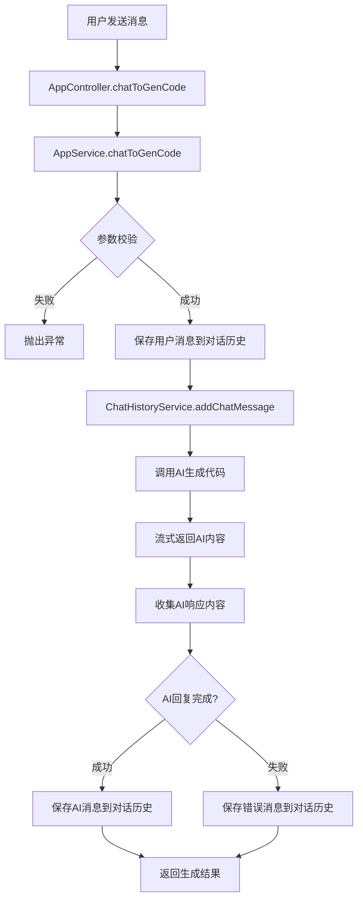
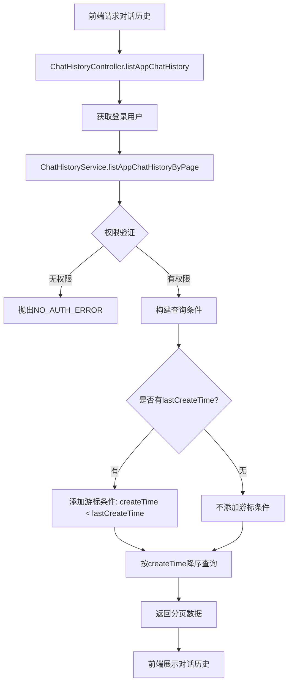
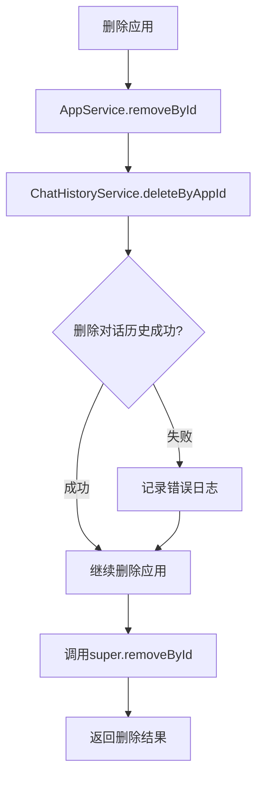

# 对话历史功能添加文档

## 概述
本文档记录了对话历史模块的完整实现，包括所有新增和修改的文件，以及功能流程说明。

## 一、新增文件

### 1. ChatHistoryMessageTypeEnum.java
**路径**: `src/main/java/com/frank/aicodehelper/model/enums/ChatHistoryMessageTypeEnum.java`

**功能**: 定义对话消息类型枚举（USER、AI）

**主要内容**:
- `USER("用户", "user")` - 用户消息
- `AI("AI", "ai")` - AI消息
- `getEnumByValue(String value)` - 根据值获取枚举

### 2. ChatHistoryQueryRequest.java
**路径**: `src/main/java/com/frank/aicodehelper/model/dto/chathistory/ChatHistoryQueryRequest.java`

**功能**: 对话历史查询请求对象，支持游标分页查询

**主要字段**:
- `id` - 对话历史ID
- `message` - 消息内容
- `messageType` - 消息类型
- `appId` - 应用ID
- `userId` - 用户ID
- `lastCreateTime` - 游标字段，用于分页查询

## 二、修改文件

### 1. ChatHistoryService.java
**路径**: `src/main/java/com/frank/aicodehelper/service/ChatHistoryService.java`

**新增方法**:
```java
// 添加对话消息
boolean addChatMessage(Long appId, String message, String messageType, Long userId);

// 根据应用ID删除对话历史
boolean deleteByAppId(Long appId);

// 获取查询包装类
QueryWrapper getQueryWrapper(ChatHistoryQueryRequest chatHistoryQueryRequest);

// 分页查询某个应用的对话历史（游标查询）
Page<ChatHistory> listAppChatHistoryByPage(Long appId, int pageSize, 
                                            LocalDateTime lastCreateTime, 
                                            User loginUser);
```

### 2. ChatHistoryServiceImpl.java
**路径**: `src/main/java/com/frank/aicodehelper/service/impl/ChatHistoryServiceImpl.java`

**主要功能实现**:

#### 2.1 addChatMessage - 添加对话消息
- 参数校验
- 验证消息类型有效性
- 构建ChatHistory对象并保存

#### 2.2 deleteByAppId - 删除应用的所有对话历史
- 根据appId构建查询条件
- 批量删除对话历史

#### 2.3 getQueryWrapper - 构建查询条件
- 支持多条件查询
- **游标查询核心**: 使用 `lastCreateTime` 实现游标分页
- 默认按创建时间降序排序

#### 2.4 listAppChatHistoryByPage - 分页查询对话历史
- 权限验证：只有应用创建者和管理员可查看
- 支持游标分页
- 页面大小限制：1-50条

**新增依赖**:
- `@Resource @Lazy private AppService appService;` - 使用@Lazy避免循环依赖

### 3. AppServiceImpl.java
**路径**: `src/main/java/com/frank/aicodehelper/service/impl/AppServiceImpl.java`

**主要修改**:

#### 3.1 新增依赖
```java
@Resource
private ChatHistoryService chatHistoryService;
```

#### 3.2 chatToGenCode方法 - 集成对话历史保存
**修改前**: 仅调用AI生成代码

**修改后**:
1. 用户发送消息时，立即保存用户消息到对话历史
2. 使用响应式编程收集AI回复内容
3. AI回复完成后，保存AI消息到对话历史
4. AI回复失败时，也保存错误消息

**核心代码**:
```java
// 5. 添加用户消息
chatHistoryService.addChatMessage(appId, message, 
    ChatHistoryMessageTypeEnum.USER.getValue(), loginUser.getId());

// 6-7. 收集AI响应并保存
StringBuilder aiResponseBuilder = new StringBuilder();
return contentFlux
    .map(chunk -> {
        aiResponseBuilder.append(chunk);
        return chunk;
    })
    .doOnComplete(() -> {
        String aiResponse = aiResponseBuilder.toString();
        if (StrUtil.isNotBlank(aiResponse)) {
            chatHistoryService.addChatMessage(appId, aiResponse, 
                ChatHistoryMessageTypeEnum.AI.getValue(), loginUser.getId());
        }
    })
    .doOnError(error -> {
        String errorMessage = "AI回复失败: " + error.getMessage();
        chatHistoryService.addChatMessage(appId, errorMessage, 
            ChatHistoryMessageTypeEnum.AI.getValue(), loginUser.getId());
    });
```

#### 3.3 removeById方法 - 关联删除对话历史
**新增方法**: 重写removeById方法

**功能**:
1. 删除应用前，先删除该应用的所有对话历史
2. 采用容错设计：对话历史删除失败不影响应用删除
3. 记录错误日志

**核心代码**:
```java
@Override
public boolean removeById(Serializable id) {
    // 转换为 Long 类型
    Long appId = Long.valueOf(id.toString());
    
    // 先删除关联的对话历史
    try {
        chatHistoryService.deleteByAppId(appId);
    } catch (Exception e) {
        log.error("删除应用关联对话历史失败: {}", e.getMessage());
    }
    
    // 删除应用
    return super.removeById(id);
}
```

### 4. ChatHistoryController.java
**路径**: `src/main/java/com/frank/aicodehelper/controller/ChatHistoryController.java`

**完全重写**: 替换自动生成的CRUD接口为业务接口

**新增接口**:

#### 4.1 GET /chatHistory/app/{appId} - 游标查询应用对话历史
**参数**:
- `appId` - 应用ID（路径参数）
- `pageSize` - 页面大小（默认10）
- `lastCreateTime` - 游标参数（可选）

**返回**: `BaseResponse<Page<ChatHistory>>`

**权限**: 需要登录，且只能查看自己创建的应用或管理员查看

#### 4.2 POST /chatHistory/admin/list/page/vo - 管理员查询所有对话历史
**参数**: `ChatHistoryQueryRequest` (RequestBody)

**返回**: `BaseResponse<Page<ChatHistory>>`

**权限**: 仅管理员

## 三、功能流程图

### 1. 对话生成流程



### 2. 对话历史查询流程



### 3. 应用删除关联流程



## 四、核心技术要点

### 1. 游标分页查询
**优势**:
- 解决传统offset分页在数据变化时的不一致问题
- 高效：直接定位到游标位置，无需扫描前面的数据
- 适合实时聊天场景

**实现**:
```sql
SELECT * FROM chat_history 
WHERE appId = ? AND createTime < ? 
ORDER BY createTime DESC 
LIMIT ?
```

**数据库索引**: 需要在 `(appId, createTime)` 上创建复合索引

### 2. 响应式编程 - 对话历史保存
使用Reactor的`Flux`特性:
- `map()` - 收集每个数据块
- `doOnComplete()` - 流完成时保存AI消息
- `doOnError()` - 流出错时保存错误消息

### 3. 循环依赖解决
`ChatHistoryServiceImpl`需要注入`AppService`用于权限验证，而`AppServiceImpl`需要注入`ChatHistoryService`用于保存对话历史，形成循环依赖。

**解决方案**: 使用`@Lazy`注解延迟初始化
```java
@Resource
@Lazy
private AppService appService;
```

### 4. 权限控制
- **查看对话历史**: 应用创建者或管理员
- **管理所有对话**: 仅管理员（使用`@AuthCheck`注解）

## 五、数据库设计

### chat_history表结构
```sql
CREATE TABLE chat_history (
    id          BIGINT AUTO_INCREMENT PRIMARY KEY COMMENT 'id',
    message     TEXT NOT NULL COMMENT '消息',
    messageType VARCHAR(32) NOT NULL COMMENT 'user/ai',
    appId       BIGINT NOT NULL COMMENT '应用id',
    userId      BIGINT NOT NULL COMMENT '创建用户id',
    createTime  DATETIME DEFAULT CURRENT_TIMESTAMP NOT NULL COMMENT '创建时间',
    updateTime  DATETIME DEFAULT CURRENT_TIMESTAMP NOT NULL ON UPDATE CURRENT_TIMESTAMP COMMENT '更新时间',
    isDelete    TINYINT DEFAULT 0 NOT NULL COMMENT '是否删除',
    INDEX idx_appId (appId),
    INDEX idx_createTime (createTime),
    INDEX idx_appId_createTime (appId, createTime)
) COMMENT '对话历史' COLLATE = utf8mb4_unicode_ci;
```

**关键索引**:
- `idx_appId_createTime` - 游标查询核心索引

## 六、API接口文档

### 1. 查询应用对话历史
```
GET /api/chatHistory/app/{appId}?pageSize=10&lastCreateTime=2025-11-18T10:00:00
```

**请求参数**:
| 参数 | 类型 | 必填 | 说明 |
|-----|------|------|------|
| appId | Long | 是 | 应用ID（路径参数） |
| pageSize | int | 否 | 页面大小，默认10，最大50 |
| lastCreateTime | LocalDateTime | 否 | 游标时间，查询早于此时间的记录 |

**响应示例**:
```json
{
  "code": 200,
  "data": {
    "records": [
      {
        "id": 1,
        "message": "生成一个博客网站",
        "messageType": "user",
        "appId": 123,
        "userId": 1,
        "createTime": "2025-11-18T10:30:00"
      },
      {
        "id": 2,
        "message": "<!DOCTYPE html>...",
        "messageType": "ai",
        "appId": 123,
        "userId": 1,
        "createTime": "2025-11-18T10:30:05"
      }
    ],
    "totalRow": 20,
    "pageSize": 10,
    "pageNumber": 1,
    "totalPage": 2
  },
  "message": "ok"
}
```

### 2. 管理员查询所有对话历史
```
POST /api/chatHistory/admin/list/page/vo
```

**请求体**:
```json
{
  "pageNum": 1,
  "pageSize": 10,
  "appId": 123,
  "messageType": "user",
  "sortField": "createTime",
  "sortOrder": "descend"
}
```

**权限**: 需要管理员角色

## 七、测试建议

### 1. 单元测试
- 测试`addChatMessage`方法的参数校验
- 测试`deleteByAppId`方法的删除逻辑
- 测试游标查询的边界情况

### 2. 集成测试
- 测试对话流程：发送消息 -> 保存历史 -> 查询历史
- 测试关联删除：删除应用 -> 验证对话历史已删除
- 测试权限控制：非创建者无法查看对话历史

### 3. 性能测试
- 测试游标查询在大数据量下的性能
- 测试并发场景下的对话历史保存

## 八、后续优化建议

1. **对话历史导出功能** - 支持导出为Markdown文件
2. **对话记忆管理** - 集成Redis实现AI对话记忆
3. **对话历史搜索** - 支持全文搜索对话内容
4. **对话统计** - 统计应用的对话轮数、用户活跃度等

## 九、注意事项

1. **游标查询的前端实现**:
   - 初次加载不传`lastCreateTime`
   - 加载更多时传最后一条消息的`createTime`
   - 前端需维护消息列表，将新加载的消息插入到列表开头

2. **数据一致性**:
   - AI回复失败时也会保存错误消息，确保对话完整性
   - 删除应用时关联删除对话历史，避免数据冗余

3. **性能优化**:
   - 必须创建`(appId, createTime)`复合索引
   - 限制单次查询的最大数量（50条）

4. **安全性**:
   - 严格的权限控制，防止越权访问
   - 对话内容可能包含敏感信息，注意数据保护

---

**文档版本**: 1.0  
**创建日期**: 2025-11-18  
**作者**: AI Code Helper Team

