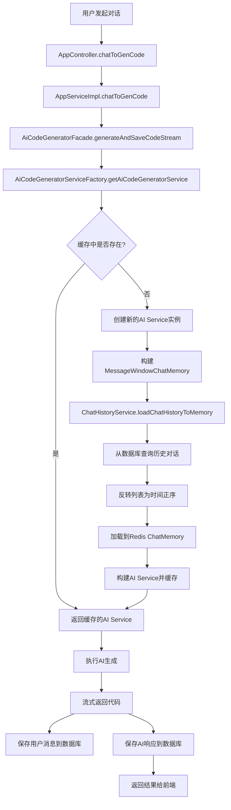
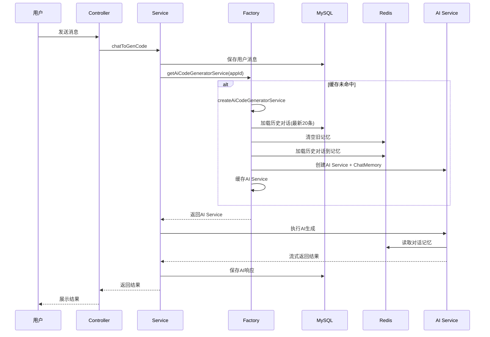

# 对话记忆和Redis分布式Session功能添加文档

## 概述

本文档记录了基于 doc6.txt 第5节（对话记忆）和第6节（Redis 分布式 Session）的功能实现过程。

实现内容：
1. **对话记忆功能**：使用 Redis 持久化存储 AI 对话记忆，实现应用级别的记忆隔离，支持从数据库加载历史对话
2. **本地缓存优化**：使用 Caffeine 缓存 AI Service 实例，提升性能
3. **Redis 分布式 Session**：将用户登录态从内存迁移到 Redis，实现服务重启后免登录

## 一、依赖配置

### 1.1 pom.xml 修改

**文件路径**: `d:\ai-code-helper\pom.xml`

**修改内容**:

1. **启用 Redis 对话记忆依赖**（第114-118行）:
```xml
<dependency>
    <groupId>dev.langchain4j</groupId>
    <artifactId>langchain4j-community-redis-spring-boot-starter</artifactId>
    <version>1.1.0-beta7</version>
</dependency>
```

2. **添加 Spring Session Redis 依赖**（第146-150行）:
```xml
<!-- Spring Session + Redis -->
<dependency>
    <groupId>org.springframework.session</groupId>
    <artifactId>spring-session-data-redis</artifactId>
</dependency>
```

**功能说明**:
- `langchain4j-community-redis-spring-boot-starter`: 提供 Redis 对话记忆存储能力
- `spring-session-data-redis`: 支持将 Session 存储到 Redis

## 二、配置文件修改

### 2.1 application.yml 配置

**文件路径**: `d:\ai-code-helper\src\main\resources\application.yml`

**修改内容**:

```yaml
spring:
  # redis
  data:
    redis:
      host: localhost
      port: 6379
      # password:  # 如果 Redis 有密码再启用
      database: 0
      ttl: 3600  # 新增：对话记忆过期时间（秒）
  # session 配置（新增）
  session:
    store-type: redis
    # session 30 天过期
    timeout: 2592000

server:
  servlet:
    # cookie 30 天过期（新增）
    session:
      cookie:
        max-age: 2592000
```

**功能说明**:
- `ttl: 3600`: Redis 中对话记忆的过期时间为 1 小时
- `session.store-type: redis`: Session 存储类型设置为 Redis
- `session.timeout: 2592000`: Session 过期时间为 30 天（秒）
- `cookie.max-age: 2592000`: Cookie 过期时间为 30 天（秒）

## 三、新增文件

### 3.1 Redis 对话记忆存储配置类

**文件路径**: `d:\ai-code-helper\src\main\java\com\frank\aicodehelper\config\RedisChatMemoryStoreConfig.java`

**完整代码**:

```java
package com.frank.aicodehelper.config;

import dev.langchain4j.community.store.memory.chat.redis.RedisChatMemoryStore;
import lombok.Data;
import org.springframework.boot.context.properties.ConfigurationProperties;
import org.springframework.context.annotation.Bean;
import org.springframework.context.annotation.Configuration;

@Configuration
@ConfigurationProperties(prefix = "spring.data.redis")
@Data
public class RedisChatMemoryStoreConfig {

    private String host;

    private int port;

    private String password;

    private long ttl;

    @Bean
    public RedisChatMemoryStore redisChatMemoryStore() {
        return RedisChatMemoryStore.builder()
                .host(host)
                .port(port)
                .password(password)
                .ttl(ttl)
                .build();
    }
}
```

**功能说明**:
- 从 `application.yml` 读取 Redis 配置
- 创建 `RedisChatMemoryStore` Bean，用于存储对话记忆
- 支持密码认证（如果 Redis 设置了密码）

**注意事项**:
- 如果 Redis 版本 ≥ 6 且设置了密码，需要配置 `user` 参数（默认用户名为 `default`）
- 如果 Redis 没有密码，`password` 配置可以为空

## 四、修改的文件

### 4.1 启动类修改

**文件路径**: `d:\ai-code-helper\src\main\java\com\frank\aicodehelper\AiCodeHelperApplication.java`

**修改内容**:

```java
import dev.langchain4j.community.store.embedding.redis.RedisEmbeddingStoreAutoConfiguration;

@SpringBootApplication(exclude = {RedisEmbeddingStoreAutoConfiguration.class})
@MapperScan("com.frank.aicodehelper.mapper")
public class AiCodeHelperApplication {
    // ...
}
```

**功能说明**:
- 排除 `RedisEmbeddingStoreAutoConfiguration` 自动装配
- 本项目不使用 Embedding 功能，避免启动报错

### 4.2 AI Service 工厂类重构

**文件路径**: `d:\ai-code-helper\src\main\java\com\frank\aicodehelper\ai\AiCodeGeneratorServiceFactory.java`

**重大变更**:

1. **引入对话记忆和缓存**:
```java
@Resource
private RedisChatMemoryStore redisChatMemoryStore;

@Resource
private ChatHistoryService chatHistoryService;

private final Cache<Long, AiCodeGeneratorService> serviceCache = Caffeine.newBuilder()
        .maximumSize(1000)
        .expireAfterWrite(Duration.ofMinutes(30))
        .expireAfterAccess(Duration.ofMinutes(10))
        .removalListener((key, value, cause) -> {
            log.debug("AI 服务实例被移除，appId: {}, 原因: {}", key, cause);
        })
        .build();
```

2. **新增方法：根据 appId 获取 AI Service（带缓存）**:
```java
public AiCodeGeneratorService getAiCodeGeneratorService(long appId) {
    return serviceCache.get(appId, this::createAiCodeGeneratorService);
}
```

3. **新增私有方法：创建 AI Service 实例**:
```java
private AiCodeGeneratorService createAiCodeGeneratorService(long appId) {
    log.info("为 appId: {} 创建新的 AI 服务实例", appId);
    // 根据 appId 构建独立的对话记忆
    MessageWindowChatMemory chatMemory = MessageWindowChatMemory
            .builder()
            .id(appId)
            .chatMemoryStore(redisChatMemoryStore)
            .maxMessages(20)
            .build();
    // 从数据库加载历史对话到记忆中
    chatHistoryService.loadChatHistoryToMemory(appId, chatMemory, 20);
    return AiServices.builder(AiCodeGeneratorService.class)
            .chatModel(chatModel)
            .streamingChatModel(streamingChatModel)
            .chatMemory(chatMemory)
            .build();
}
```

4. **保留默认 Bean**:
```java
@Bean
public AiCodeGeneratorService aiCodeGeneratorService() {
    return getAiCodeGeneratorService(0L);
}
```

**功能说明**:
- **方案 2（AI Service 隔离）**: 每个 appId 对应一个独立的 AI Service 实例
- **Caffeine 本地缓存**: 缓存 AI Service 实例，避免重复创建，提升性能
  - 最大缓存 1000 个实例
  - 写入后 30 分钟过期
  - 访问后 10 分钟过期
- **对话记忆**: 每个 AI Service 绑定独立的 Redis 对话记忆（最多保留 20 条消息）
- **历史对话加载**: 创建 AI Service 时，自动从数据库加载最新 20 条历史对话到 Redis

**技术亮点**:
- 懒加载：只有在对话时才会创建 AI Service 和加载历史记忆
- 内存优化：通过过期策略自动清理不活跃的 AI Service 实例
- 数据一致性：数据库作为持久化存储，Redis 作为会话缓存

### 4.3 ChatHistoryService 接口扩展

**文件路径**: `d:\ai-code-helper\src\main\java\com\frank\aicodehelper\service\ChatHistoryService.java`

**新增方法**:

```java
import dev.langchain4j.memory.ChatMemory;

/**
 * 加载对话历史到记忆中
 *
 * @param appId       应用ID
 * @param chatMemory  对话记忆
 * @param maxCount    最大加载数量
 * @return 实际加载的数量
 */
int loadChatHistoryToMemory(Long appId, ChatMemory chatMemory, int maxCount);
```

**功能说明**:
- 从数据库加载指定应用的历史对话到 Redis 记忆中
- 支持限制最大加载数量

### 4.4 ChatHistoryServiceImpl 实现类扩展

**文件路径**: `d:\ai-code-helper\src\main\java\com\frank\aicodehelper\service\impl\ChatHistoryServiceImpl.java`

**新增导入**:
```java
import cn.hutool.core.collection.CollUtil;
import dev.langchain4j.data.message.AiMessage;
import dev.langchain4j.data.message.UserMessage;
import dev.langchain4j.memory.ChatMemory;
import lombok.extern.slf4j.Slf4j;
import java.util.List;
```

**添加 @Slf4j 注解**:
```java
@Service
@Slf4j
public class ChatHistoryServiceImpl extends ServiceImpl<ChatHistoryMapper, ChatHistory>  implements ChatHistoryService{
```

**新增方法实现**:

```java
@Override
public int loadChatHistoryToMemory(Long appId, ChatMemory chatMemory, int maxCount) {
    try {
        // 直接构造查询条件，起始点为 1 而不是 0，用于排除最新的用户消息
        QueryWrapper queryWrapper = QueryWrapper.create()
                .eq(ChatHistory::getAppId, appId)
                .orderBy(ChatHistory::getCreateTime, false)
                .limit(1, maxCount);
        List<ChatHistory> historyList = this.list(queryWrapper);
        if (CollUtil.isEmpty(historyList)) {
            return 0;
        }
        // 反转列表，确保按时间正序（老的在前，新的在后）
        historyList = historyList.reversed();
        // 按时间顺序添加到记忆中
        int loadedCount = 0;
        // 先清理历史缓存，防止重复加载
        chatMemory.clear();
        for (ChatHistory history : historyList) {
            if (ChatHistoryMessageTypeEnum.USER.getValue().equals(history.getMessageType())) {
                chatMemory.add(UserMessage.from(history.getMessage()));
                loadedCount++;
            } else if (ChatHistoryMessageTypeEnum.AI.getValue().equals(history.getMessageType())) {
                chatMemory.add(AiMessage.from(history.getMessage()));
                loadedCount++;
            }
        }
        log.info("成功为 appId: {} 加载了 {} 条历史对话", appId, loadedCount);
        return loadedCount;
    } catch (Exception e) {
        log.error("加载历史对话失败，appId: {}, error: {}", appId, e.getMessage(), e);
        // 加载失败不影响系统运行，只是没有历史上下文
        return 0;
    }
}
```

**功能说明**:

1. **查询起始点为 1**:
   - 排除最新的用户消息，因为用户消息被添加到数据库后，AI Service 也会自动将用户消息添加到记忆中
   - 避免消息重复

2. **反转列表**:
   - 数据库查询结果按时间降序排列（新的在前）
   - 需要反转为时间正序（老的在前）才能正确加载到记忆中

3. **清理缓存**:
   - 加载前先清空 Redis 中的历史对话记忆，防止重复加载

4. **容错设计**:
   - 加载失败不影响系统运行，只是没有历史上下文
   - 记录错误日志，便于排查问题

**技术细节**:
- 使用 MyBatis-Flex 的 `limit(1, maxCount)` 跳过第一条记录
- 使用 `List.reversed()` 方法反转列表（Java 21 新特性）
- 区分 USER 和 AI 消息类型，分别转换为 `UserMessage` 和 `AiMessage`

### 4.5 AI 代码生成门面类修改

**文件路径**: `d:\ai-code-helper\src\main\java\com\frank\aicodehelper\core\AiCodeGeneratorFacade.java`

**修改内容**:

1. **替换注入的依赖**:
```java
// 修改前
@Resource
private AiCodeGeneratorService aiCodeGeneratorService;

// 修改后
@Resource
private AiCodeGeneratorServiceFactory aiCodeGeneratorServiceFactory;
```

2. **修改所有使用 AI Service 的方法**:

在 `generateAndSaveCode` 方法中:
```java
// 根据 appId 获取对应的 AI 服务实例
AiCodeGeneratorService aiCodeGeneratorService = aiCodeGeneratorServiceFactory.getAiCodeGeneratorService(appId);
```

在 `generateAndSaveCodeStream` 方法中:
```java
// 根据 appId 获取对应的 AI 服务实例
AiCodeGeneratorService aiCodeGeneratorService = aiCodeGeneratorServiceFactory.getAiCodeGeneratorService(appId);
```

**功能说明**:
- 所有 AI 代码生成操作都使用工厂方法根据 appId 获取对应的 AI Service
- 确保每个应用使用独立的对话记忆
- 利用 Caffeine 缓存机制提升性能

### 4.6 ChatHistoryController 修复

**文件路径**: `d:\ai-code-helper\src\main\java\com\frank\aicodehelper\controller\ChatHistoryController.java`

**修改内容**:

修复第 48 行的语法错误，补全方法名:
```java
// 修改前
public BaseResponse<Page<ChatHistory>>  (@PathVariable Long appId,

// 修改后
public BaseResponse<Page<ChatHistory>> listAppChatHistory(@PathVariable Long appId,
```

## 五、功能流程图



### 对话记忆工作原理



## 六、技术要点总结

### 6.1 对话记忆方案对比

| 方案 | 优点 | 缺点 | 适用场景 |
|------|------|------|----------|
| **方案1：@MemoryId注解** | 修改成本低，代码简洁 | 所有应用共用一个AI Service实例 | 简单场景，对性能要求不高 |
| **方案2：AI Service隔离** | 每个应用独立实例，支持本地缓存 | 需要重构工厂类 | 生产环境，需要性能优化 |

**本项目采用方案2**，原因：
- 更好的隔离性：每个应用的配置可以独立调整
- 性能更优：结合 Caffeine 本地缓存
- 扩展性强：易于增加应用级别的自定义配置

### 6.2 Redis 存储结构

**对话记忆 Key 格式**:
```
langchain4j:chat-memory:{appId}
```

**Session Key 格式**:
```
spring:session:sessions:{sessionId}
spring:session:sessions:expires:{sessionId}
```

### 6.3 过期策略

| 类型 | 过期时间 | 说明 |
|------|----------|------|
| Redis 对话记忆 | 3600秒（1小时） | 防止 Redis 内存占满 |
| Caffeine 缓存 | 写入后30分钟，访问后10分钟 | 平衡内存和性能 |
| Session | 2592000秒（30天） | 长期保持登录状态 |
| Cookie | 2592000秒（30天） | 与 Session 保持一致 |

### 6.4 关键技术点

1. **游标查询起始点为 1**:
   - 排除最新的用户消息，避免重复
   - 使用 `limit(1, maxCount)` 实现

2. **消息顺序处理**:
   - 数据库：降序（新的在前）
   - Redis：正序（老的在前）
   - 需要 `reversed()` 反转

3. **容错设计**:
   - 历史对话加载失败不影响系统运行
   - 只是当次对话没有历史上下文

4. **本地缓存优化**:
   - 避免重复创建 AI Service 实例
   - 减少数据库和 Redis 的访问次数

## 七、测试验证

### 7.1 功能测试点

1. **对话记忆测试**:
   - [ ] 创建新应用，进行多轮对话，验证 AI 能记住之前的对话
   - [ ] 重启服务，验证对话记忆能从数据库恢复
   - [ ] 查看 Redis，验证对话记忆正确存储
   - [ ] 验证不同应用的对话记忆相互隔离

2. **缓存测试**:
   - [ ] 同一应用多次对话，验证 AI Service 实例被复用
   - [ ] 验证缓存过期策略生效（30分钟未使用自动清除）
   - [ ] 查看日志，确认缓存命中率

3. **Session 测试**:
   - [ ] 登录后重启服务，验证无需重新登录
   - [ ] 查看 Redis，验证 Session 信息正确存储
   - [ ] 验证 Session 过期时间（30天）

### 7.2 预期结果

**Redis 中的数据**:

1. **对话记忆**（示例 appId=123）:
```json
[
  {
    "text": "... 系统消息 ...",
    "type": "SYSTEM"
  },
  {
    "contents": [
      {
        "text": "做个博客网站",
        "type": "TEXT"
      }
    ],
    "type": "USER"
  },
  {
    "text": "... AI 回复 ...",
    "type": "AI"
  }
]
```

2. **Session 信息**:
```
spring:session:sessions:{sessionId}
spring:session:sessions:expires:{sessionId}
```

## 八、注意事项

### 8.1 Redis 配置

1. **密码认证**:
   - Redis 6+ 版本需要配置 `user` 参数（默认为 `default`）
   - Redis 6- 版本只需要配置 `password`

2. **内存管理**:
   - 必须设置 `ttl` 过期时间，防止内存泄漏
   - 建议根据业务量调整过期时间

### 8.2 性能优化

1. **Caffeine 缓存参数调优**:
   - `maximumSize`: 根据并发用户数调整
   - `expireAfterWrite`: 根据对话频率调整
   - `expireAfterAccess`: 根据用户活跃度调整

2. **对话记忆数量控制**:
   - `maxMessages=20`: 平衡记忆效果和性能
   - 过多会增加 AI Token 消耗
   - 过少会影响对话连贯性

### 8.3 循环依赖

- `ChatHistoryServiceImpl` 注入 `AppService` 时使用 `@Lazy` 注解
- `AiCodeGeneratorServiceFactory` 注入 `ChatHistoryService` 可能需要 `@Lazy`（如果出现循环依赖）

## 九、扩展建议

1. **智能记忆管理**（较难）:
   - 利用 AI 分析对话历史，智能总结过去的对话
   - 节省 Token 的同时优化记忆效果

2. **记录应用对话总轮次**:
   - 统计每个应用的对话轮数
   - 用于分析用户使用习惯

3. **对话历史导出功能**:
   - 支持导出对话记录为 Markdown 文件
   - 便于用户保存和分享开发过程

4. **多人协作对话**（较难）:
   - 允许多个用户共同参与一个应用的对话
   - 实现团队协作开发

## 十、文件变更清单

### 新增文件

| 文件路径 | 说明 |
|---------|------|
| `config/RedisChatMemoryStoreConfig.java` | Redis 对话记忆存储配置类 |

### 修改文件

| 文件路径 | 主要修改内容 |
|---------|--------------|
| `pom.xml` | 启用 Redis 对话记忆依赖，添加 Spring Session Redis 依赖 |
| `application.yml` | 配置 Redis ttl、Session 存储和过期时间 |
| `AiCodeHelperApplication.java` | 排除 RedisEmbeddingStore 自动装配 |
| `AiCodeGeneratorServiceFactory.java` | 重构为 AI Service 隔离 + Caffeine 缓存方案 |
| `ChatHistoryService.java` | 新增 loadChatHistoryToMemory 方法 |
| `ChatHistoryServiceImpl.java` | 实现 loadChatHistoryToMemory 方法，添加 @Slf4j |
| `AiCodeGeneratorFacade.java` | 使用工厂根据 appId 获取 AI Service |
| `ChatHistoryController.java` | 修复 listAppChatHistory 方法签名 |

---

**文档生成时间**: 2025-11-18  
**实现人员**: AI Assistant  
**参考文档**: doc6.txt 第5节、第6节

